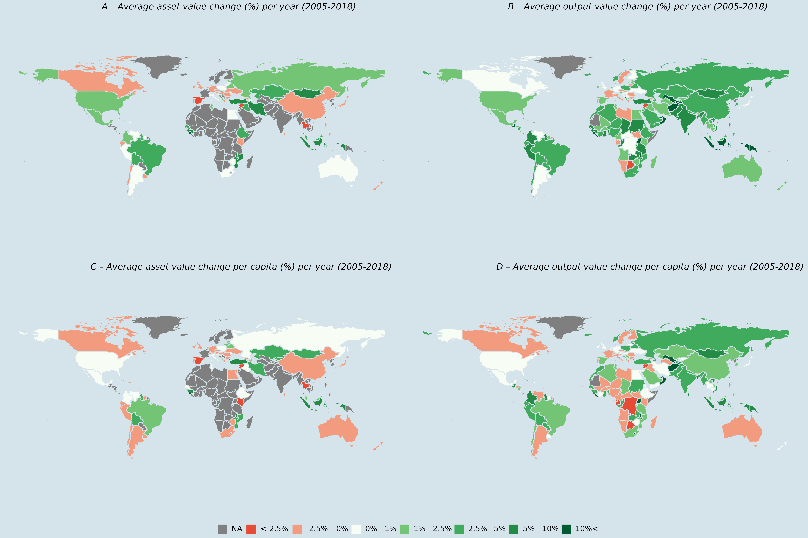

```{r setup, include=FALSE}
knitr::opts_chunk$set(
    echo = FALSE, warning = FALSE, 
    dev = c("png", "tiff"), 
    dpi = 300
    )
knitr::opts_knit$set(root.dir = here::here())


suppressPackageStartupMessages(
    {
        library(dplyr)
        library(ggplot2)
    }
)

theme_set(
    theme_bw()  + 
        theme(axis.title = element_text(color = "grey30"))
          )
```

```{r}
knitr::opts_knit$set(fig.path = "docs")
```

\newpage

\listoffigures

\newpage

\listoftables

\newpage

```{r, cache=TRUE}

config <- config::get()


local({
  # Local environment due to combining multiple figures

  # Constants ---------------------------------------------------------------
  year_range <- 2005:2018
  df_file <- config$data$output$livestock_values


  # Data Prep ---------------------------------------------------------------

  # Load in the livestock value data
  data <- arrow::read_parquet(df_file, as_data_frame = TRUE) |>
    dplyr::filter(year %in% year_range) |>
    dplyr::mutate(iso3_code = toupper(iso3_code))


  # Load the world bank poulation dataset
  population <- LivestockValueGBADS::world_bank_population |>
    dplyr::filter(year %in% year_range) |>
    dplyr::rename(iso3_code = country_code)
  
  assets_pre <<- data |>
    dplyr::filter(
      head > 0,
      stock_value_constant_2014_2016_usd > 0,
      item == "stock"
    ) |>
    dplyr::mutate(value = stock_value_constant_2014_2016_usd) |>
    dplyr::group_by(iso3_code, year) |>
    dplyr::summarise(
      value = sum(value, na.rm = TRUE),
      tonnes = sum(tonnes, na.rm = TRUE), 
      .groups = "drop"
    ) 
  
  assets <<- assets_pre |>
    dplyr::left_join(population, by = c("iso3_code", "year")) |>
    dplyr::group_by(iso3_code) |>
    dplyr::arrange(year) %>%
    dplyr::mutate(
      value_percap = value / population
    ) |>
    dplyr::mutate(
      value_pct_change = 100 * (value - lag(value)) / (lag(value)) / (year - lag(year))
    ) %>%
    dplyr::mutate(
      value_percap = 100 * (value_percap - lag(value_percap)) / (lag(value_percap)) / (year - lag(year))
    ) 
  
})


year_range <- 2005:2018

df_list <- config$data$output[c("aquaculture_values",
                                "livestock_values")]

# Load in the data
data <- purrr::map(
    df_list,
    ~ arrow::read_parquet(.x, as_data_frame = TRUE) |>
        filter(year %in% year_range) |>
        mutate(iso3_code = toupper(iso3_code))
)

# Summarise by Country and produce a total value
data$livestock_outputs <- data$livestock_values |>
    filter(gross_production_value_constant_2014_2016_thousand_us > 0,
                  tonnes > 0) |>
    tidyr::drop_na(gross_production_value_constant_2014_2016_thousand_us) |>
    group_by(iso3_code, year) |>
    summarise(
        value = sum(
            gross_production_value_constant_2014_2016_thousand_us,
            na.rm = TRUE
        ) * 1000,
          tonnes = sum(tonnes, na.rm = TRUE), 
        .groups = "drop"
    ) |> 
    mutate(is_aqua=  FALSE)

data$aquaculture_outputs <- data$aquaculture_values |>
    filter(constant_2014_2016_usd_value > 0,
                  tonnes > 0) |>
    group_by(iso3_code, year) |>
    summarise(value = sum(constant_2014_2016_usd_value, na.rm = TRUE), 
              tonnes = sum(tonnes, na.rm = TRUE), 
              .groups = "drop") |> 
    mutate(is_aqua=  TRUE)

# Load the world bank poulation dataset
population <- LivestockValueGBADS::world_bank_population |>
    filter(year %in% year_range) |>
    rename(iso3_code = country_code)


outputs_pre <-  bind_rows(data$livestock_outputs, data$aquaculture_outputs) |>
    group_by(iso3_code, year) |>
     filter(!all(is_aqua)) |> 
    summarise(value = sum(value, na.rm = TRUE),
              tonnes = sum(tonnes, na.rm = TRUE), 
                     .groups = "drop") 
    
outputs <- outputs_pre |> 
    left_join(population, by = c("iso3_code", "year")) |>
    group_by(iso3_code) |>
    arrange(year) %>%
    filter(value > 0) |>
    mutate(value_percap = value / population) |>
    mutate(value_pct_change = 100 * (value - lag(value)) / (lag(value)) / (year - lag(year))) |>
    mutate(value_percap = 100 * (value_percap - lag(value_percap)) / (lag(value_percap)) / (year - lag(year))) |> 
    group_by(iso3_code) |>
    mutate(max_change = max(abs(value_pct_change), na.rm = TRUE))

# Combined assets and outputs
# Just combine all and make a note
combined <- bind_rows(outputs_pre, assets_pre)  |> 
    group_by(iso3_code, year)  |> 
    summarise(value = sum(value, na.rm = TRUE),
              tonnes = sum(tonnes, na.rm = TRUE), 
                     .groups = "drop") |>
    left_join(population, by = c("iso3_code", "year")) |>
    group_by(iso3_code) |>
    arrange(year) %>%
    filter(value > 0) |>
    mutate(value_percap = value / population) |>
    mutate(value_pct_change = 100 * (value - lag(value)) / (lag(value)) / (year - lag(year))) |>
    mutate(value_percap = 100 * (value_percap - lag(value_percap)) / (lag(value_percap)) / (year - lag(year))) 


```


# Outline 

This is a short report in response to reviewer comments for clarification on
the interpretation of Figure 5.   


##  Comments

The reviewers would like clarification on 

> *Essentially, the question is what can be an explanation for the finding that
 the output value for high income countries decreased between 2005-2018, while
 the output value increased for lower income countries. [for figure 5] (Peggy)
 I’m wondering if the quantity of output decreased for high income countries and
 is reflected in the value of output and that the opposite was the case for the
 other countries. Could you please check that? If that is the explanation, could
 you please provide some numbers in form of a table that we could include in the
 supplementary document?*

## Response

The short answer to this question is that, no, the output value produced by high
income countries actually did not (in constant dollar) decline over the *2005* to
*2018* period.  
Rather, some countries exhibited a slight decline, however, overall,   all income
groups increased. This is shown in the figures in *Sections 1.4 to 1.6*.


There are some instances (e.g., Australia and Canada), which had negative 
average annual growth overall, however, had negative average growth per capita.

There are some specific instances where a high income country exhibited a decline and 
a lower income country showed an increase, however, this is mostly 
explained by reductions in the mass of outputs.

```{r,message=FALSE}

outputs_change <- outputs |>
    ungroup() |>
    group_by(iso3_code, table_name, income_group) |> 
    summarise(
        start_weight = tonnes[year == min(year, na.rm = TRUE)],  
        end_weight = tonnes[year == max(year, na.rm = TRUE)], 
        end_value = value[year == max(year, na.rm = TRUE)], 
        start_value = value[year == min(year, na.rm = TRUE)], 
        growth = round(mean(value_pct_change, na.rm = TRUE), 2), 
    )  |> 
    mutate(
        diff_weight = scales::comma(end_weight - start_weight , scale = 1e-3, suffix = "k"), 
        diff_value = scales::dollar(end_value - start_value , scale = 1e-9, suffix = "b") 
        ) |> 
    filter(
        (growth < 0 && income_group == "High income" ) || 
        (growth >  0 && income_group == "Low income" ), start_weight > 1e4
    ) |> 
    arrange(income_group)  |> 
    select(iso3_code, income_group, table_name, growth, diff_weight, diff_value) 

outputs_change |>  write.csv("docs/high_low_inncome_growth_change.csv", row.names = FALSE)


```

\footnotesize
```{r}
outputs_change |> 
    ungroup() |> 
    filter(iso3_code != "HKG", income_group == "High income") |> 
    arrange(desc(diff_value)) |> 
    select(Country = table_name,  `Value Change` = diff_value , `Output Tonnes change (k)` = diff_weight, `Average Growth (%)` = growth)  |> 
    knitr::kable(
        caption = "High income countries with averaged annual negative growth rate in output values (2014-16 USD) between 2005-2018.",
        align = "lccc"
    )
```

\normalsize

In some cases where this not occur, notably France and Italy, uncertainty around
the data and what was reported can potentially account for the difference as the
total value changes between 2005 and 2018 ($1$ and $0.9$ Billion respectively)
have averaged annual growth rates of relatively small magnitude ($-0.26$ and
$-0.27$).  The positive change in outputs of $1,623$k and $1132$k are less
than $5\%$ and $7\%$ of the total mass outputs for each country. 
The difference for the mass in Italy is mostly driven by the $2018$ data point, 
which drags up the entire series.

\newpage

```{r fra_ita, fig.width=8, fig.height=6}
#| fig.cap = "France and Italy output in millions of tonnes from 2005 to 2018.",
#| fig.width=8,
#| fig.height=6
outputs |> 
    filter(iso3_code %in% c("FRA", "ITA")) |> 
    ggplot() + 
    geom_point(aes(x = year, y = tonnes)) + 
    geom_line(aes(x = year, y = tonnes)) + 
    scale_y_continuous(limits = c(0, NA),         labels = scales::comma_format(scale = 1e-6, suffix = "m") )+ 
    scale_x_continuous(breaks = seq(year_range[1], year_range[length(year_range)], by = 3)  ) + 
    facet_wrap(~table_name, scales = "free_y") + 
    labs(
        x = "Year", 
        y = "Tonnes", 
    ) + 
    theme(
        axis.title.y = element_text(angle = 0, vjust = 0.5)
    )
```


\footnotesize
```{r}
outputs_change |> 
    ungroup() |> 
    filter(iso3_code != "HKG", income_group == "Low income") |> 
    arrange(desc(diff_value)) |> 
    select(Country = table_name,  `Value Change` = diff_value , `Output Tonnes change (k)` = diff_weight ,  `Average Growth (%)` = growth ) |> 
    knitr::kable(
        caption = "Low income countries with averaged annual positive growth rate in output values (2014-16 USD) between 2005-2018.", 
        align = "lccc"
    )
    
```
\normalsize


\newpage

## Notes on Method

Also note,  what is shown in the figure is **not** simple growth rate, 
i.e., 

$$
   \% = \frac{x_{2018} - x_{2005}}{x_{2005} (2018 - 2005)} \cdot  100
$$

Rather, it is the averaged annual growth rate. Which is, as the name says, an
average of all the annual growth rates during the period. This was initially
chosen due to the lack of data points in some of these time series as the simple
average growth rate is heavily reliant on the two end points of the time series,
which in the case of sparse data can be problematic. However, it can be
susceptible to large outlier data points changing the entire growth rate.

\newpage 

## Absolute Values


### Output Values

The follow figure shows the absolute changes in terrestrial livestock outputs
over the time period of *2005* to *2018* broken up by income group.


```{r income_group_change_outputs, cache=FALSE, warning=FALSE}
#| fig.cap= "Output Production in Billions of 2014-16 USD (2005-2018).
#|  Income designations sourced from World Bank (2022)."
outputs_income_group <- outputs |>  
    filter(!is.na(income_group)) |> 
    mutate(income_group = stringr::str_to_title(trimws(gsub("income", "", income_group)))) |> 
    group_by(income_group, year) |> 
    summarise(
        tonnes = sum(tonnes, na.rm = TRUE), 
        value = sum(value, na.rm = TRUE), 
        population = sum(population, na.rm = TRUE),
        .groups = "drop"
    ) |> 
    group_by(income_group)  |> 
    arrange(year) |> 
    mutate(value_pct_change = 100 * (value - lag(value)) / (lag(value)) / (year - lag(year)))  

outputs_income_group$income_group <-  factor(outputs_income_group$income_group, levels = c("Low", "Lower Middle", "Upper Middle", "High")) 
    
outputs_income_group |> 
    ggplot() + 
    geom_line(aes(x = year, y = value)) + 
    geom_point(aes(x = year, y = value)) + 
    scale_y_continuous(limits = c(0, NA), labels = scales::dollar_format(scale = 1e-9, suffix = "b", accuracy = 1)) + 
    scale_x_continuous(breaks = seq(year_range[1], year_range[length(year_range)], by = 3)) + 
    facet_wrap(~income_group, scales = "free_y", ncol = 2)  + 
    labs(
        x = "Year", 
        y = "$", 
    ) + 
    theme(
        axis.title.y = element_text(angle = 0, vjust = 0.5)
    )
    
```


```{r income_percap_outputs}
#| fig.cap= "Output Production per capita in  2014-16 USD (2005-2018).
#|  Income designations sourced from World Bank (2022)."
outputs_income_group |> 
    mutate(value = value / population) |> 
    ggplot() + 
    geom_line(aes(x = year, y = value)) + 
    geom_point(aes(x = year, y = value)) + 
    scale_y_continuous(limits = c(0, NA)) + 
    scale_x_continuous(breaks = seq(year_range[1], year_range[length(year_range)], by = 3)) + 
    facet_wrap(~income_group, scales = "free_y", ncol = 2)  + 
    labs(
        x = "Year", 
        y = "$/capita", 
    ) + 
    theme(
        axis.title.y = element_text(angle = 0, vjust = 0.5)
    )
```


```{r income_tonnes_outputs}
#| fig.cap= "Output Production in millions of tonnes (2005-2018).
#|  Income designations sourced from World Bank (2022)."
outputs_income_group |> 
    ggplot() + 
    geom_line(aes(x = year, y = tonnes)) + 
    geom_point(aes(x = year, y = tonnes)) + 
    scale_y_continuous(limits = c(0, NA),         labels = scales::comma_format(scale = 1e-6, suffix = "m") )+ 
    scale_x_continuous(breaks = seq(year_range[1], year_range[length(year_range)], by = 3)  ) + 
    facet_wrap(~income_group, scales = "free_y", ncol = 2)  + 
    labs(
        x = "Year", 
        y = "Tonnes", 
    ) + 
    theme(
        axis.title.y = element_text(angle = 0, vjust = 0.5)
    )
```


\newpage

### Asset Values


```{r income_group_change_assets, cache=FALSE, warning=FALSE}
#| fig.cap= "Livestock Asset Value in Billions of 2014-16 USD (2005-2018).
#|  Income designations sourced from World Bank (2022).
#|  Note: this is aggregated into income groups at the country level rather 
#|  than at the level of individual species. Hence, only countries which were
#|  considiered to have enough data to be included in Figure 5 were included 
#|  here."
assets_income_group <- assets |>  
    filter(!is.na(income_group)) |> 
    mutate(income_group = stringr::str_to_title(trimws(gsub("income", "", income_group)))) |> 
    group_by(income_group, year) |> 
    summarise(
        tonnes = sum(tonnes, na.rm = TRUE), 
        value = sum(value, na.rm = TRUE), 
        population = sum(population, na.rm = TRUE),
        .groups = "drop"
    ) |> 
    group_by(income_group)  |> 
    arrange(year) |> 
    mutate(value_pct_change = 100 * (value - lag(value)) / (lag(value)) / (year - lag(year)))  

assets_income_group$income_group <-  factor(assets_income_group$income_group, levels = c("Low", "Lower Middle", "Upper Middle", "High")) 
    
assets_income_group |> 
    ggplot() + 
    geom_line(aes(x = year, y = value)) + 
    geom_point(aes(x = year, y = value)) + 
    scale_y_continuous(limits = c(0, NA), labels = scales::dollar_format(scale = 1e-9, suffix = "b", accuracy = 1)) + 
    scale_x_continuous(breaks = seq(year_range[1], year_range[length(year_range)], by = 3)) + 
    facet_wrap(~income_group, scales = "free_y", ncol = 2)  + 
    labs(
        x = "Year", 
        y = "$", 
    ) + 
    theme(
        axis.title.y = element_text(angle = 0, vjust = 0.5)
    )
    
```


```{r income_percap_asset}
#| fig.cap= "Livestock Asset Value per capita in  2014-16 USD.
#|  Income designations sourced from World Bank (2022)."
assets_income_group |> 
    mutate(value = value / population) |> 
    ggplot() + 
    geom_line(aes(x = year, y = value)) + 
    geom_point(aes(x = year, y = value)) + 
    scale_y_continuous(limits = c(0, NA)) + 
    scale_x_continuous(breaks = seq(year_range[1], year_range[length(year_range)], by = 3)) + 
    facet_wrap(~income_group, scales = "free_y", ncol = 2)  + 
    labs(
        x = "Year", 
        y = "$/capita", 
    ) + 
    theme(
        axis.title.y = element_text(angle = 0, vjust = 0.5)
    )
```


```{r income_tonnes_asset}
#| fig.cap= "Livestock Assets in millions of tonnes estimated live weight (2005-2018).
#|  Income designations sourced from World Bank (2022)."
assets_income_group |> 
    ggplot() + 
    geom_line(aes(x = year, y = tonnes)) + 
    geom_point(aes(x = year, y = tonnes)) + 
    scale_y_continuous(limits = c(0, NA),         labels = scales::comma_format(scale = 1e-6, suffix = "m") )+ 
    scale_x_continuous(breaks = seq(year_range[1], year_range[length(year_range)], by = 3)  ) + 
    facet_wrap(~income_group, scales = "free_y", ncol = 2)  + 
    labs(
        x = "Year", 
        y = "Tonnes", 
    ) + 
    theme(
        axis.title.y = element_text(angle = 0, vjust = 0.5)
    )
```

\newpage 

### Combined Values


```{r income_group_change_combined, cache=FALSE, warning=FALSE}
#| fig.cap= "Combined Assets + Outputs  Value in Billions of 2014-16 USD.
#|  Income designations sourced from World Bank (2022).
#|  Note: This is the combined total for each income group. Due to data issues
#|  this means that this total may only include either the value of livestock
#|  outputs or assets for a single country."
combined_income_group <- combined |>  
    filter(!is.na(income_group)) |> 
    mutate(income_group = stringr::str_to_title(trimws(gsub("income", "", income_group)))) |> 
    group_by(income_group, year) |> 
    summarise(
        tonnes = sum(tonnes, na.rm = TRUE), 
        value = sum(value, na.rm = TRUE), 
        population = sum(population, na.rm = TRUE),
        .groups = "drop"
    ) |> 
    group_by(income_group)  |> 
    arrange(year) |> 
    mutate(value_pct_change = 100 * (value - lag(value)) / (lag(value)) / (year - lag(year)))  

combined_income_group$income_group <-  factor(combined_income_group$income_group, levels = c("Low", "Lower Middle", "Upper Middle", "High")) 
    
combined_income_group |> 
    ggplot() + 
    geom_line(aes(x = year, y = value)) + 
    geom_point(aes(x = year, y = value)) + 
    scale_y_continuous(limits = c(0, NA), labels = scales::dollar_format(scale = 1e-9, suffix = "b", accuracy = 1)) + 
    scale_x_continuous(breaks = seq(year_range[1], year_range[length(year_range)], by = 3)) + 
    facet_wrap(~income_group, scales = "free_y", ncol = 2)  + 
    labs(
        x = "Year", 
        y = "$", 
    ) + 
    theme(
        axis.title.y = element_text(angle = 0, vjust = 0.5)
    )
    
```


```{r income_percap_combined}
#| fig.cap= "Combined Assets + Outputs Value per capita in  2014-16 USD.
#|  Income designations sourced from World Bank (2022)."
combined_income_group |> 
    mutate(value = value / population) |> 
    ggplot() + 
    geom_line(aes(x = year, y = value)) + 
    geom_point(aes(x = year, y = value)) + 
    scale_y_continuous(limits = c(0, NA)) + 
    scale_x_continuous(breaks = seq(year_range[1], year_range[length(year_range)], by = 3)) + 
    facet_wrap(~income_group, scales = "free_y", ncol = 2)  + 
    labs(
        x = "Year", 
        y = "$/capita", 
    ) + 
    theme(
        axis.title.y = element_text(angle = 0, vjust = 0.5)
    )
```


```{r income_tonnes_combined}
#| fig.cap= "Combined Assets + Outputs tonnes in  2014-16 USD (2005-2018).
#|  Income designations sourced from World Bank (2022)."
combined_income_group |> 
    ggplot() + 
    geom_line(aes(x = year, y = tonnes)) + 
    geom_point(aes(x = year, y = tonnes)) + 
    scale_y_continuous(limits = c(0, NA),         labels = scales::comma_format(scale = 1e-6, suffix = "m") )+ 
    scale_x_continuous(breaks = seq(year_range[1], year_range[length(year_range)], by = 3)  ) + 
    facet_wrap(~income_group, scales = "free_y", ncol = 2)  + 
    labs(
        x = "Year", 
        y = "Tonnes", 
    ) + 
    theme(
        axis.title.y = element_text(angle = 0, vjust = 0.5)
    )
```

\newpage

## Growth Rates

### Output Value 

```{r income_group_pct_change, cache=FALSE}
#| fig.cap = "Annual growth rates for output values per income group (2005-2018). 
#|  Income designations sourced from World Bank (2022). Dashed line indicates 0 growth."
outputs_income_group |> 
    ggplot() + 
    geom_line(aes(x = year, y = value_pct_change)) + 
    geom_point(aes(x = year, y = value_pct_change)) + 
    geom_hline(yintercept = 0, linetype = "dashed") + 
    scale_x_continuous(breaks = seq(year_range[1], year_range[length(year_range)], by = 3)) + 
    facet_wrap(~income_group, scales = "free_y")  + 
    labs(
        x = "Year", 
        y = "Growth Rate (%)"
    ) 
```


```{r income_group_pct_change_percap_output, cache=FALSE}
#| fig.cap = "Annual growth rates per capita for output values per income group (2005-2018). 
#|  Income designations sourced from World Bank (2022). Dashed line indicates 0 growth."
outputs_income_group |> 
    mutate(value  = value / population) |> 
    mutate(value_pct_change = 100 * (value - lag(value)) / (lag(value)) / (year - lag(year)))   |> 
    ggplot() + 
    geom_line(aes(x = year, y = value_pct_change)) + 
    geom_point(aes(x = year, y = value_pct_change)) + 
    geom_hline(yintercept = 0, linetype = "dashed") + 
    scale_x_continuous(breaks = seq(year_range[1], year_range[length(year_range)], by = 3)) + 
    facet_wrap(~income_group, scales = "free_y")  + 
    labs(
        x = "Year", 
        y = "Growth Rate (%)"
    ) 
```


\newpage

### Asset Value 

```{r income_group_pct_change_asset, cache=FALSE}
#| fig.cap = "Annual growth rates for asset values per income group (2005-2020). 
#|  Income designations sourced from World Bank (2022). Dashed line indicates 0 growth."
assets_income_group |> 
    ggplot() + 
    geom_line(aes(x = year, y = value_pct_change)) + 
    geom_point(aes(x = year, y = value_pct_change)) + 
    geom_hline(yintercept = 0, linetype = "dashed") + 
    scale_x_continuous(breaks = seq(year_range[1], year_range[length(year_range)], by = 3)) + 
    facet_wrap(~income_group, scales = "free_y")  + 
    labs(
        x = "Year", 
        y = "Growth Rate (%)"
    ) 
```


```{r income_group_pct_change_percap_asset, cache=FALSE}
#| fig.cap = "Annual growth rates per capita for asset values per income group (2005-2018). 
#|  Income designations sourced from World Bank (2022). Dashed line indicates 0 growth."
assets_income_group |> 
    mutate(value  = value / population) |> 
    mutate(value_pct_change = 100 * (value - lag(value)) / (lag(value)) / (year - lag(year)))   |> 
    ggplot() + 
    geom_line(aes(x = year, y = value_pct_change)) + 
    geom_point(aes(x = year, y = value_pct_change)) + 
    geom_hline(yintercept = 0, linetype = "dashed") + 
    scale_x_continuous(breaks = seq(year_range[1], year_range[length(year_range)], by = 3)) + 
    facet_wrap(~income_group, scales = "free_y")  + 
    labs(
        x = "Year", 
        y = "Growth Rate (%)"
    ) 
```

\newpage


### Combined Value 

```{r income_group_pct_change_combined, cache=FALSE}
#| fig.cap = "Annual growth rates for combined livestock asset and output values per income group (2005-2018). 
#|  Income designations sourced from World Bank (2022). Dashed line indicates 0 growth."
combined_income_group |> 
    ggplot() + 
    geom_line(aes(x = year, y = value_pct_change)) + 
    geom_point(aes(x = year, y = value_pct_change)) + 
    geom_hline(yintercept = 0, linetype = "dashed") + 
    scale_x_continuous(breaks = seq(year_range[1], year_range[length(year_range)], by = 3)) + 
    facet_wrap(~income_group, scales = "free_y")  + 
    labs(
        x = "Year", 
        y = "Growth Rate (%)"
    ) 
```


```{r income_group_pct_change_percap_combined, cache=FALSE}
#| fig.cap = "Annual growth rates per capita for combined livestock asset and output values per income group (2005-2018). 
#|  Income designations sourced from World Bank (2022). Dashed line indicates 0 growth."
combined_income_group |> 
    mutate(value  = value / population) |> 
    mutate(value_pct_change = 100 * (value - lag(value)) / (lag(value)) / (year - lag(year)))   |> 
    ggplot() + 
    geom_line(aes(x = year, y = value_pct_change)) + 
    geom_point(aes(x = year, y = value_pct_change)) + 
    geom_hline(yintercept = 0, linetype = "dashed") + 
    scale_x_continuous(breaks = seq(year_range[1], year_range[length(year_range)], by = 3)) + 
    facet_wrap(~income_group, scales = "free_y")  + 
    labs(
        x = "Year", 
        y = "Growth Rate (%)"
    ) 
```


\newpage
## Summary Table


\footnotesize
```{r}
output_summary_table <- outputs_income_group |>
    select(income_group, year, value, population)  |>
    mutate(value_percap = value / population) |>
    select(-population) |>
    mutate(
        value = scales::dollar(
            value,
            scale = 1e-9,
            suffix = "b",
            accuracy = 1
        ),
        value_percap = as.character(round(value_percap, 0))
    ) |>
    tidyr::pivot_longer(c("value", "value_percap")) |>
    tidyr::pivot_wider(names_from = "year", values_from = "value")

output_summary_table |> write.csv("docs/figure_5_response_summary.csv", row.names = FALSE)

```

```{r}
output_summary_table |>
    filter(name == "value") |> 
    select(-name) |> 
    arrange(income_group) |> 
    rename(Income = income_group) |> 
    knitr::kable(
        caption = "Income group aggregated livestock output values in 2014-16 USD. Income group designations from World Bank (2022)."
    ) 
```


```{r}
output_summary_table |>
    filter(name == "value_percap") |> 
    select(-name) |> 
    arrange(income_group) |> 
    rename(Income = income_group) |> 
    knitr::kable(
        caption = "Income group aggregated livestock output values per capita in 2014-16 USD. Income group designations from World Bank (2022)."
    ) 
```
\normalsize


\newpage

# Issues 

While looking into this issue, a few minor data issues were found 
in Figure 5 panes B, and D. 



In particular, there are a few minor countries which have some of the following
issues with their data 

1. Large Outlier data points which bias the entire averaged series. 

This is caused when only a countries aquaculture production is reported 
for a single year, and it can bias the average annual growth rate. 
Usually showing up with a low income country exhibiting growth,  due 
to a single outlier year. 
For lower income countries these outlier years are common, as there are many 
discrepancies with how their data is reported. 
This can be slightly misleading to viewers of the figure.

These should have been filtered for initially, however, that does not 
seem to be the case.


An updated version of the figure is shown below which removes 
the countries which only report aquatic output values.

