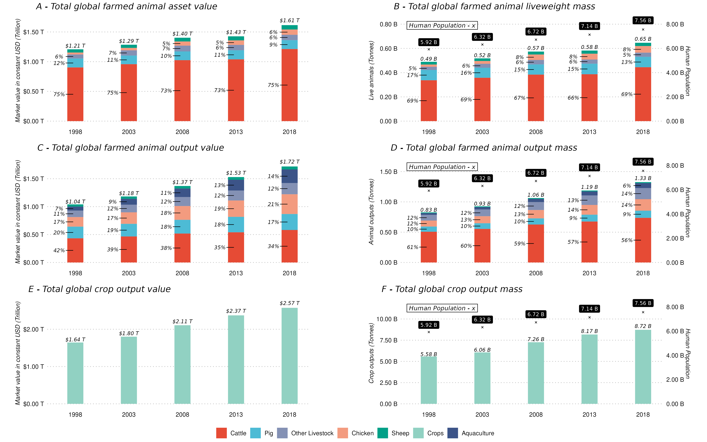
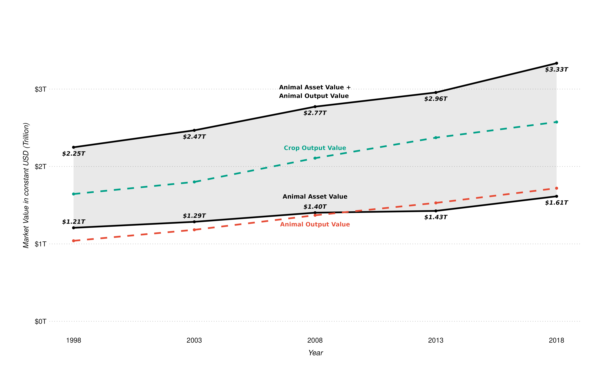
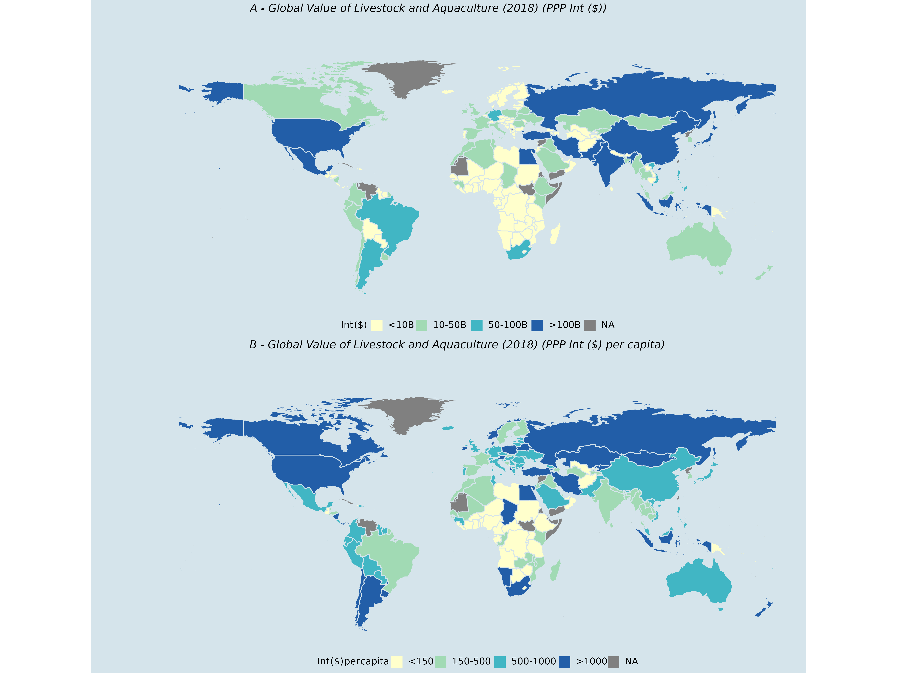
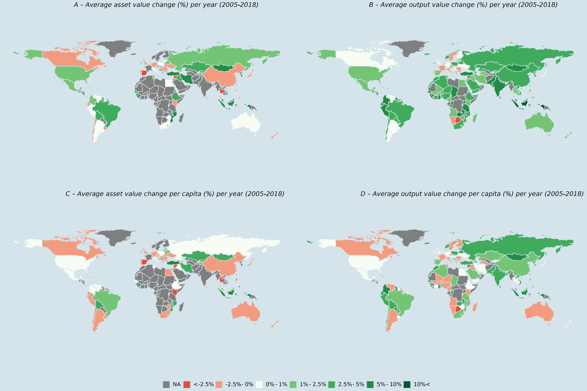
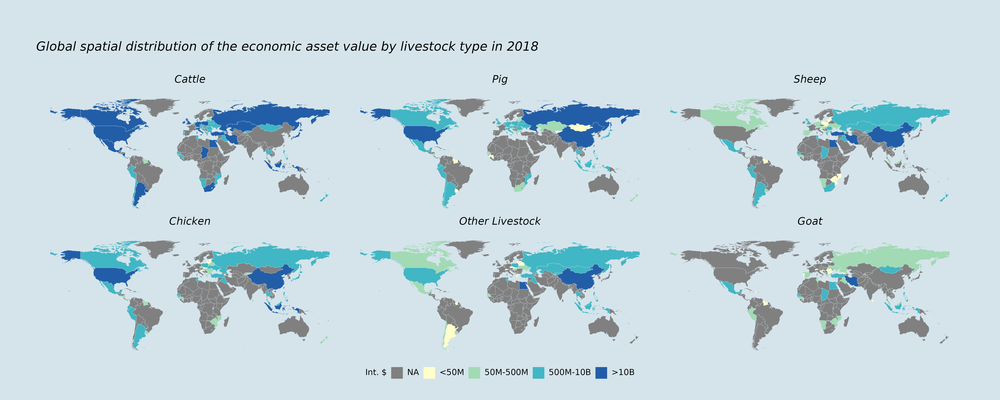
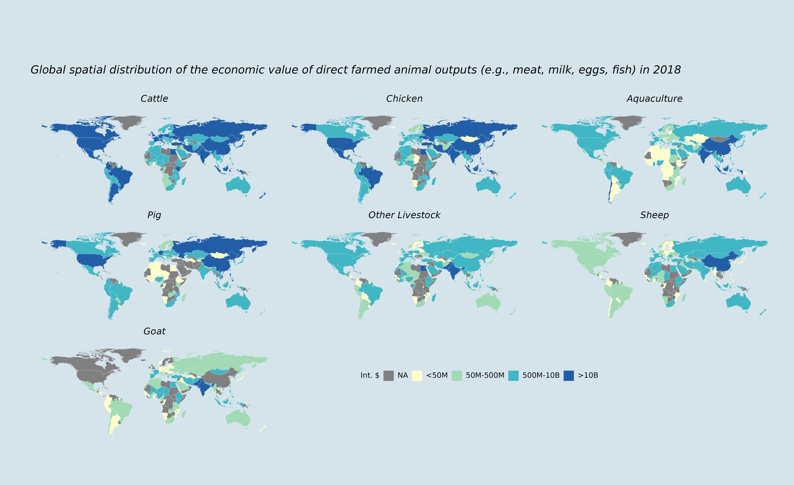

Figures
===============================================================================

<!-- markdown-toc start - Don't edit this section. Run M-x markdown-toc-refresh-toc -->

- [Figures](#figures)
- [Figure Descriptions](#figure-descriptions)
    - [Regenerate](#regenerate)
  - [Figure 2](#figure-2)
    - [Regenerate](#regenerate-1)
  - [Figure 3](#figure-3)
    - [Regenerate](#regenerate-2)
  - [Figure 4](#figure-4)
    - [Regenerate](#regenerate-3)
  - [Figure 5](#figure-5)
    - [Regenerate](#regenerate-4)
  - [Figure 6](#figure-6)
    - [Regenerate](#regenerate-5)
  - [Figure A1](#figure-a1)
    - [Regenerate](#regenerate-7)
  - [Figure A2](#figure-a2)
    - [Regenerate](#regenerate-8)

<!-- markdown-toc end -->

# Figure Descriptions

The following section contains a short description of all figures
generated here as well as the comands that can be used to generate each figure.  

### Regenerate

All figures can be regenerated using the command `make figures`.

## Figure 2

A 3 by 2 plot showing the following comparisons.

| Row   | Panel Left                                      | Panel Right                      |
| ----- | ----------------------------------------------- | -------------------------------- |
| 1     | Livestock and  Assets over time                 | Live body weight vs population   |
| 2     | Livestock Outputs over time                     | Weight vs population             |
| 3     | Crop Outputs over time (different categories)   | Crop weights vs population       |
| ----- | ----------------------------------------------- | -------------------------------- |

Each plot is a stacked area plot showing the different percentages over time.

### Regenerate

This figures is generated by the `R` script located [here](../../inst/figures/figure_2.R),
and can be rerun using the command `make output/figures/figure_2.png`.

## Figure 3

### Regenerate

This figures is generated by the `R` script located
[here](../../inst/figures/figure_3.R), and can be rerun using the command `make
output/figures/figure_3.png`.

## Figure 4

This figure uses the following series to convert to international dollars using PPP.

- [PPP Conversion to International $](https://api.worldbank.org/v2/country/all/indicator/PA.NUS.PPP?downloadformat=csv)

Population data is also sourced from the world bank, and is located [here](../../data/world_bank_population.rda)

*Note: As this figure uses PPP Conversion factors from the world bank, these
only convert current lcu/slc figures to international dollars. Therefore, for the live animal
values, countries are missing which do not have a price for the specified year.
This does not happen when using constant dollars, as the constant price from the
baseline period is used to generate values over the entire time series.*

### Regenerate

This figures is generated by the `R` script located
[here](../../inst/figures/figure_4.R), and can be rerun using the command `make
output/figures/figure_4.png`.

## Figure 5

This figure uses the following series to convert to international dollars using PPP.

- [PPP Conversion to International $](https://api.worldbank.org/v2/country/all/indicator/PA.NUS.PPP?downloadformat=csv)

Population data is also sourced from the world bank, and is located [here](../../data/world_bank_population.rda)

*Note: As this figure uses PPP Conversion factors from the world bank, these
only convert current lcu/slc figures to international dollars. Therefore, for the live animal
values, countries are missing which do not have a price for the specified year.
This does not happen when using constant dollars, as the constant price from the
baseline period is used to generate values over the entire time series.*

### Regenerate

This figures is generated by the `R` script located
[here](../../inst/figures/figure_5.R), and can be rerun using the command `make
output/figures/figure_5.png`.

## Figure 6

### Regenerate

This figures is generated by the `R` script located
[here](../../inst/figures/figure_6.R), and can be rerun using the command `make
output/figures/figure_6.png`.

## Figure A1

*Notes: This uses $2018$ Int. $ in this figures.*

### Regenerate

This figures is generated by the `R` script located
[here](../../inst/figures/figure_A1.R), and can be rerun using the command `make
output/figures/figure_A1.png`.

## Figure A2

This figure contains several world maps showing the output value for livestock
output items (e.g., Meat, Milk, Eggs, ...) for each of the following livestock
types.

- Cattle
- Sheep
- Goat
- Chicken
- Pig
- Aquaculture

The values shown in this map are computed by converting LCU/SLC values to
PPP adjusted International dollars (using a conversion factor from the world bank) for the year $2018$.

*Note: This uses $2018$ Int. $ in this figures.*

### Regenerate

This figures is generated by the `R` script located
[here](../../inst/figures/figure_A2.R), and can be rerun using the command `make
output/figures/figure_A4.png`.
